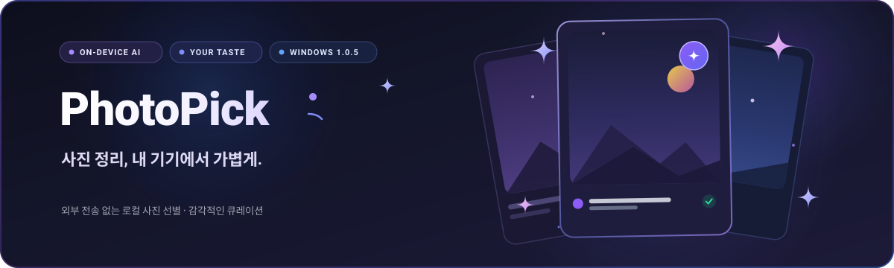

  

  <strong>좋은 사진은 남기고, 비슷한 사진은 가볍게 정리해요.</strong> 
  사진의 기본 품질과 내가 고른 취향을 함께 참고하는 온디바이스 사진 정리 앱.

  
  
  
  

  <a href="https://github.com/songtan-ajae/PhotoPick/releases/tag/v1.0.5"><strong>⬇ Windows v1.0.5 다운로드</strong></a>
  · <a href="docs/USER_GUIDE.md">사용 방법</a>
  · <a href="docs/SCREENSHOTS.md">화면 둘러보기</a>
  · <a href="THIRD_PARTY_NOTICES.md">라이선스와 출처</a>

## 어떤 앱인가요?

한 장씩 넘기며 보관할 사진을 고르거나, AI 추천대로 먼저 분류한 뒤 필요한 사진만 다시 확인할 수 있어요. 비슷한 사진을 묶어서 비교하고, 잘 찍혔다고 생각하는 내 사진을 알려주면 다음 추천에 취향을 반영해요.

사진 분석과 취향 처리는 내 기기에서 진행해요. 사진을 외부 AI 서버로 보내지 않으며, 이 배포본에는 분석 모델과 설명용 사진도 함께 들어 있어요.

| 가볍게 시작하기 | 스와이프로 검토하기 | 취향 반영 정도 조절하기 |
| :---: | :---: | :---: |
|  |  |  |

*실제 앱 UI를 자동 렌더링한 예시 화면이에요. 작은 화면은 반응형 UI 미리보기이며, 모바일 출시를 뜻하지 않아요. 화면 속 사진·수치·분류는 테스트용 예시입니다. [사진 출처 및 캡처 안내](docs/SCREENSHOTS.md)*

## 주요 기능

- **좌측 보관 / 우측 삭제 대기**: 마우스 드래그, 방향키, 버튼으로 선택해요. 방금 선택한 결과는 되돌릴 수 있어요.
- **비슷한 사진 비교**: 유사 사진을 묶고 참고할 추천 컷을 보여줘요.
- **AI 추천대로 정리하기**: 추천 적용을 확인하면 보관·삭제 대기로 바로 분류돼요. 결과와 이유는 원할 때 다시 검토해요.
- **내 사진으로 취향 알려주기**: 비슷한 촬영본에서 마음에 드는 컷을 고르거나 좋아하는 사진을 여러 장 선택해요.
- **품질을 먼저 확인하는 추천**: 초점·흐림·저해상도 같은 기본 결함을 취향보다 먼저 검사해요. 표시 강도가 100%여도 실제 취향 비중은 최대 80%, 기본 품질 비중은 최소 20%예요.
- **삭제 대기에서도 스와이프**: 삭제 대기는 원본 삭제가 아니에요. 다시 보관으로 돌리거나, 별도 확인 후 Windows 휴지통으로 이동해요.
- **쉽게 보는 분석 설명**: 예시 사진으로 설명하고, 설정의 `더욱더 자세히 설명하기`에서 계산 방식과 한계를 따로 확인해요.
- **다시 시작하기**: 분류 초기화와 취향 초기화를 분리해 시연하거나 처음부터 다시 정리할 수 있어요.
- **일관된 화면**: Material 3 기반의 라이트·다크 테마와 화면 폭에 대응하는 레이아웃을 제공해요.

## 설치와 실행

1. [릴리즈](https://github.com/songtan-ajae/PhotoPick/releases/tag/v1.0.5)에서 `PhotoPick-v1.0.5-win-x64-public.zip`을 받아요.
2. ZIP **전체를 압축 해제**해요. 실행파일만 따로 꺼내면 모델·DLL·폰트가 없어 실행되지 않아요.
3. 폴더 안의 `photo_curator.exe`를 실행하고 사진 폴더를 선택해요.

설치형 프로그램이 아닌 폴더형 배포예요. 현재 배포 대상은 **Windows x64**이며 macOS·Android·iOS/iPadOS 버전과 모바일 기본 갤러리 자동 연동은 아직 제공하지 않아요. HEIC/HEIF는 현재 지원하지 않아요.

현재 실행파일은 코드 서명되지 않았어요. Windows 경고가 나타날 수 있으며, 보안 기능을 끄지 말고 게시자·다운로드 출처와 `SHA256SUMS.txt`를 확인해 주세요. 자세한 내용은 [실행 안내](docs/USER_GUIDE.md)를 참고해 주세요.

## v1.0.5에서 달라진 점

- AI 추천을 적용하면 분류를 바로 저장하고 완료 화면으로 이동해요. 재검토는 선택 사항이에요.
- 설정에 `사용자 취향 반영 정도` 메뉴를 분리했어요. 슬라이더 아래 설명을 항상 볼 수 있어요.
- 라이트 모드에서 배경·카드·설명 영역의 구분을 강화했어요.
- 상태 저장 실패와 복구, 취향 강도 변경 등 회귀 검사를 추가했어요.

### 검증 범위와 한계

v1.0.5 빌드에 대해 자동 테스트 498건 통과, 정적 분석 0 issues, Windows 네이티브 진단에서 124장에 대한 로컬 ONNX 실행을 확인했어요. 공개용 ZIP은 이 검증된 실행파일·런타임·모델을 바꾸지 않고 사용자 안내와 고지문만 정리한 패키지입니다.

이 결과가 사람의 추천 만족도나 정확도 99%를 의미하지는 않아요. 취향 학습은 로컬 사진 특성 기반이며, 사진의 의미·추억·모든 구도를 이해하거나 NIMA 모델을 재학습하는 기능은 아니에요. AI 결과는 참고용이므로 중요한 사진을 실제로 삭제하기 전에는 직접 확인해 주세요. 실제 모바일 기기·macOS 사용성 검증은 수행하지 않았어요.

## 공개 범위와 라이선스

이 저장소는 **실행파일 배포 전용**입니다. 포토픽 자체 소스코드는 공개하지 않으며, 앱 전체에 MIT 라이선스를 부여하지 않습니다. GitHub가 자동 생성하는 `Source code` ZIP/TAR에는 이 저장소의 소개 문서·이미지·고지문만 들어 있고 앱 구현 소스는 없습니다.

외부 라이브러리·모델·폰트·예시 사진에는 각각의 원래 라이선스가 적용됩니다. [전체 고지](THIRD_PARTY_NOTICES.md)와 [licenses](licenses/)에 저작권·라이선스 문구를 보관했으며 실행 패키지에도 포함했어요. 실제 사용자 사진, 테스트 사진 모음, 분류·취향 데이터, 내부 작업 로그는 배포하지 않아요.

## 피드백

[Issues](https://github.com/songtan-ajae/PhotoPick/issues)에 버그나 개선 의견을 남겨 주세요. 버전, 재현 순서, 기대한 동작을 적으면 도움이 돼요. 개인 사진·파일 경로·취향 데이터는 올리지 않아도 됩니다.
