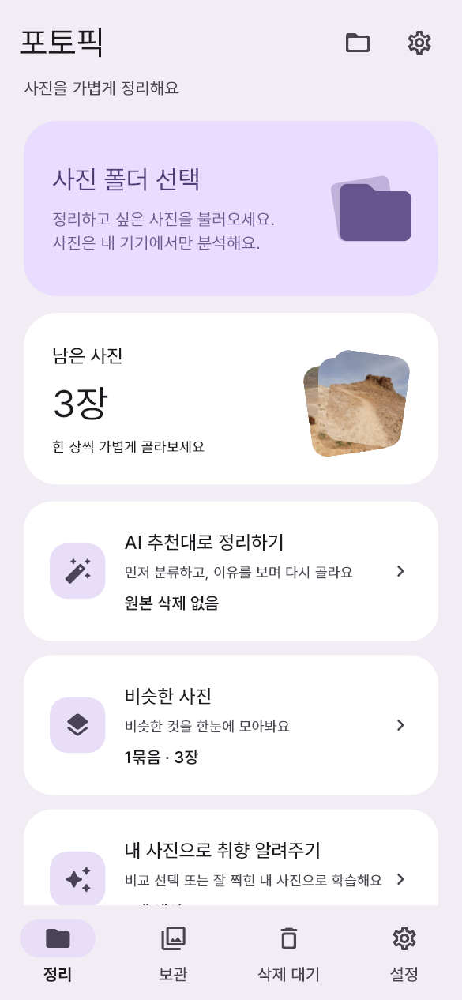
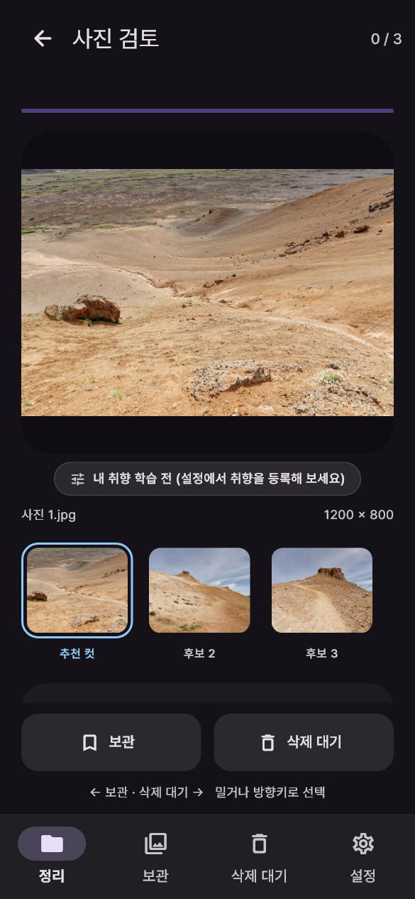
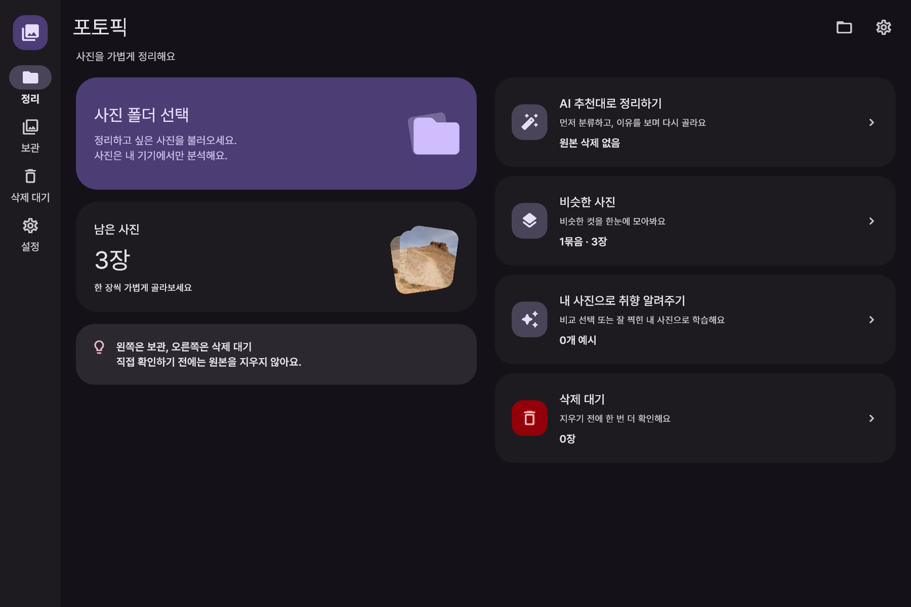

# 화면 둘러보기

이 이미지는 실제 Flutter 앱의 UI를 자동 렌더링한 캡처입니다. 배너는 Gemini가 만든 브랜드 그래픽이며 앱 화면이 아닙니다. 화면의 사진·수치·분류는 테스트용 예시이고, 사람의 추천 정확도나 성능 실측값을 의미하지 않습니다.

홈·검토 화면은 v1.0.3의 검증 캡처 중 v1.0.5에서도 유지된 화면입니다. 취향 설정·즉시 분류 완료 화면은 v1.0.5의 독립 검증 캡처입니다. 작은 화면은 반응형 미리보기이며 현재 출시된 모바일 앱을 뜻하지 않습니다.

## 라이트 / 다크

| 홈 · 라이트 | 검토 · 다크 | 취향 설정 · 라이트 |
| :---: | :---: | :---: |
|  |  |  |

## 큰 화면

## AI 분류 완료

## 사진 저작권

홈·검토 화면에 보이는 세 장의 아이슬란드 사진은 **Jakub Hałun**, [CC BY 4.0](https://creativecommons.org/licenses/by/4.0/)입니다. UI 안에서 크기 조절·배치·일부 잘라 보이기가 적용됐습니다. 원본 파일과 출처는 다음과 같습니다.

- [View from Námafjall Mountain, Iceland, 20240716 1123 1325](https://commons.wikimedia.org/wiki/File:View_from_N%C3%A1mafjall_Mountain,_Iceland,_20240716_1123_1325.jpg)
- [Hiking trail at Námafjall Mountain, Iceland, 20240716 1123 1327](https://commons.wikimedia.org/wiki/File:Hiking_trail_at_N%C3%A1mafjall_Mountain,_Iceland,_20240716_1123_1327.jpg)
- [Hiking trail at Námafjall Mountain, Iceland, 20240716 1126 1334](https://commons.wikimedia.org/wiki/File:Hiking_trail_at_N%C3%A1mafjall_Mountain,_Iceland,_20240716_1126_1334.jpg)

캡처 속 파일명에 `cc0`가 있었던 테스트 픽스처도 실제로는 위 **CC BY 4.0** 사진입니다. 파일 해시로 출처를 대조했으며 CC0로 표기하지 않습니다. 앱의 오프라인 설명용 사진 네 장은 [별도 고지](../licenses/EXAMPLE-PHOTOS-CREDITS.md)를 참고하세요.
